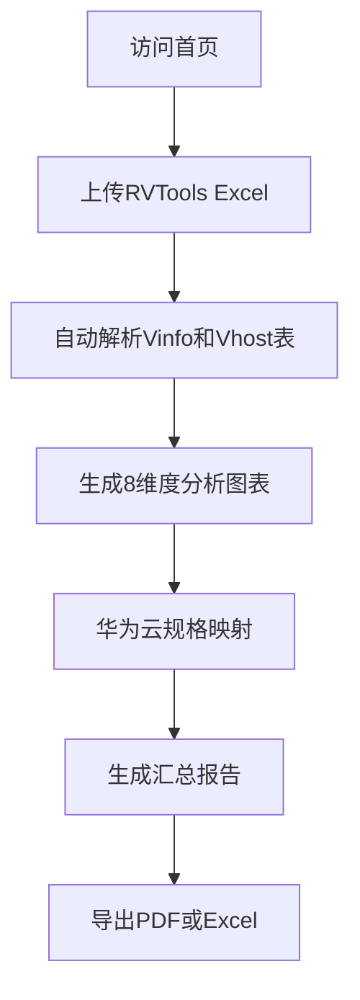
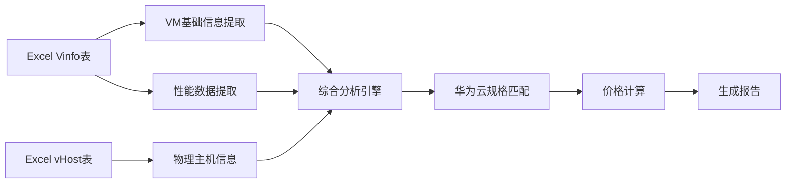

# RVTools Excel 分析工具 - 产品需求文档

## 1. 产品概述

RVTools VMware虚拟机分析工具是一款专为企业VMware到华为云迁移场景设计的Web应用程序。系统通过解析RVTools导出的Excel文件，自动进行8个维度的VMware资源分析，并智能映射到华为云ECS和EVS规格，提供价格估算和迁移风险评估。

**核心价值：**
- 自动化解析RVTools Excel格式，零手动录入
- 8维度深度分析，识别性能和成本风险
- 智能华为云规格匹配，价格最优方案推荐
- 一键生成分析报告和导出文件

**目标用户：** 企业IT架构师、云计算迁移工程师、VMware管理员

## 2. 核心功能模块

### 2.1 功能架构

| 模块 | 功能点 | 优先级 |
|------|--------|--------|
| 文件上传 | Excel文件拖拽/点击上传，自动识别RVTools格式 | P0 |
| 操作系统分析 | 统计OS类型和版本分布，识别TOP风险VM | P0 |
| CPU利用率分析 | 4区间性能瓶颈分析（<5%/5-10%/>10%/>20%） | P0 |
| 超分比分析 | 计算CPU超分比，评估虚拟化效率 | P0 |
| 内存利用率分析 | 3区间利用率分析（<30%/30-60%/>80%） | P0 |
| 存储利用率分析 | 3区间存储效率分析（<30%/30-70%/>80%） | P0 |
| 华为云映射 | ECS规格匹配+EVS存储推荐+价格计算 | P0 |
| 汇总报告 | 源端/华为云资源对比，导出PDF/Excel | P0 |

### 2.2 核心分析逻辑

**CPU超分比计算：**
```
超分比 = SUM(vInfo.CPU) / SUM(vHost.Cores)
```

**内存利用率：**
```
内存利用率 = Active Memory / Memory × 100%
```

**存储利用率：**
```
存储利用率 = In Use (MiB) / Provisioned (MiB) × 100%
```

**华为云规格匹配规则：**
1. vCPU数量满足源端需求
2. CPU/内存比接近源端虚机
3. 最大网卡数满足源端网卡数
4. 优先X系列，优选RI预留实例
5. 数据库VM优先通用型SSD V2，其他选高IO

## 3. 用户交互流程

### 3.1 主流程



### 3.2 数据映射流程



## 4. 界面设计规范

### 4.1 视觉风格

**设计理念：** 企业级数据仪表盘 - 专业、高效、数据驱动

**配色方案：**
- 主色：#1890FF（华为云蓝）
- 辅助色：#52C41A（成功绿）、#FAAD14（警告黄）、#F5222D（危险红）
- 背景色：#F0F2F5（浅灰背景）、#FFFFFF（卡片白）
- 文字色：#262626（主文字）、#8C8C8C（次要文字）

**字体选择：**
- 标题：思源黑体 / Noto Sans SC Bold
- 正文：思源黑体 / Noto Sans SC Regular
- 数据：DIN Alternate / Roboto Mono

**布局方式：**
- 卡片式布局，模块化设计
- 顶部导航+侧边分析模块
- 图表区域采用响应式网格（3列/2列/1列自适应）

### 4.2 页面结构

```
┌─────────────────────────────────────────────────────┐
│                    顶部导航栏                         │
│  Logo  |  RVTools分析工具  |  华为云区域选择  | 帮助  │
├─────────────────────────────────────────────────────┤
│                                                     │
│   ┌─────────────────────────────────────────────┐   │
│   │         文件上传区域（拖拽+点击）              │   │
│   │              支持.xlsx格式                    │   │
│   └─────────────────────────────────────────────┘   │
│                                                     │
│   ┌─────────┐ ┌─────────┐ ┌─────────┐ ┌─────────┐  │
│   │ VM总数  │ │ vCPU    │ │ 内存总量 │ │ 存储总量 │  │
│   │         │ │ 总量    │ │         │ │         │  │
│   └─────────┘ └─────────┘ └─────────┘ └─────────┘  │
│                                                     │
│   ┌─────────────────────────────────────────────┐   │
│   │              操作系统分析图表                  │   │
│   │         饼图+柱状图+TOP风险VM列表             │   │
│   └─────────────────────────────────────────────┘   │
│                                                     │
│   ┌──────────────────┐ ┌──────────────────────────┐ │
│   │  CPU利用率分析    │ │      超分比分析           │ │
│   │   环形图+区间分布  │ │     当前值+建议值         │ │
│   └──────────────────┘ └──────────────────────────┘ │
│                                                     │
│   ┌──────────────────┐ ┌──────────────────────────┐ │
│   │  内存利用率分析   │ │      存储利用率分析        │ │
│   │   环形图+区间分布  │ │     环形图+区间分布       │ │
│   └──────────────────┘ └──────────────────────────┘ │
│                                                     │
│   ┌─────────────────────────────────────────────┐   │
│   │              华为云映射及报价                  │   │
│   │    表格形式展示每台VM的映射结果                 │   │
│   └─────────────────────────────────────────────┘   │
│                                                     │
│   ┌─────────────────────────────────────────────┐   │
│   │                 汇总对比报告                  │   │
│   │       源端资源 vs 华为云资源 对比图表           │   │
│   └─────────────────────────────────────────────┘   │
│                                                     │
│              [导出PDF]  [导出Excel]  [打印报告]       │
│                                                     │
└─────────────────────────────────────────────────────┘
```

### 4.3 交互规范

- 文件拖拽区域：支持拖拽文件进入，高亮提示
- 图表悬停：显示详细数据tooltip
- 表格排序：支持按列排序
- 导出按钮：PDF导出包含所有图表和报告，Excel仅导出映射及报价

## 5. 数据输出格式

### 5.1 华为云映射表格字段

| 字段名 | 说明 | 来源 |
|--------|------|------|
| VM Name | 虚拟机名称 | vInfo |
| OS | 操作系统 | vInfo |
| vCPU | CPU数量 | vInfo |
| Memory (MB) | 内存大小 | vInfo |
| CPU Usage (%) | CPU使用率 | vInfo |
| Active Memory (MB) | 活跃内存 | vInfo |
| Provisioned MiB | 分配存储 | vInfo |
| In Use (MB) | 已用存储 | vInfo |
| DB | 是否数据库 | 用户判断 |
| CPU Memory Ratio | CPU/内存比 | 计算 |
| Mem Util | 内存利用率 | 计算 |
| Storage Util | 存储利用率 | 计算 |
| Category | 用途分类 | 规则判断 |
| ECS Instance family | 华为云实例族 | 匹配 |
| ECS Instance Type | 华为云实例规格 | 匹配 |
| vCPU | 云虚机vCPU | flavor |
| Memory GiB | 云虚机内存 | flavor |
| CPU Memory Ratio | 云虚机CPU内存比 | 计算 |
| Disk | 系统盘大小 | 配置 |
| Disk Type | 磁盘类型 | 规则 |
| Monthly | 月度价格 | 计算 |
| Yearly | 年度价格 | 计算 |

### 5.2 报告导出格式

**PDF报告内容：**
1. 封面（标题+日期+源文件名）
2. 源端资源汇总
3. 8个分析维度详细图表
4. 华为云资源映射汇总
5. 风险分析和建议

**Excel导出内容：**
- Sheet1: 华为云映射明细（包含所有VM）
- Sheet2: 汇总数据
- Sheet3: 资源分类统计

## 6. 技术约束

### 6.1 浏览器兼容性
- Chrome 90+
- Firefox 88+
- Edge 90+
- Safari 14+

### 6.2 文件大小限制
- 最大支持50MB的Excel文件
- 建议单文件不超过5000台VM

### 6.3 数据安全
- 所有数据处理在浏览器端完成
- 不上传文件到服务器
- 刷新页面后数据清除

### 6.4 性能目标
- 5000台VM解析时间 < 10秒
- 图表渲染时间 < 3秒
- PDF生成时间 < 15秒

## 7. 华为云规格数据

### 7.1 规格选择数据源
- 华为云ECS规格：https://support.huaweicloud.com/intl/zh-cn/productdesc-ecs/ecs_01_0014.html
- 价格计算器：https://www.huaweicloud.com/intl/zh-cn/pricing/calculator.html#/ecs

### 7.2 存储类型选择规则
- 数据库VM：通用型SSD V2
- 其他场景：高IO

## 8. 验收标准

1. ✅ 成功解析RVTools导出的标准xlsx文件
2. ✅ 8个分析维度图表准确展示
3. ✅ 华为云规格匹配逻辑正确
4. ✅ 价格计算结果与官方计算器一致
5. ✅ PDF报告完整且格式正确
6. ✅ Excel导出数据完整准确
7. ✅ 界面响应流畅，无明显卡顿
8. ✅ 支持华为云不同region的规格选择
