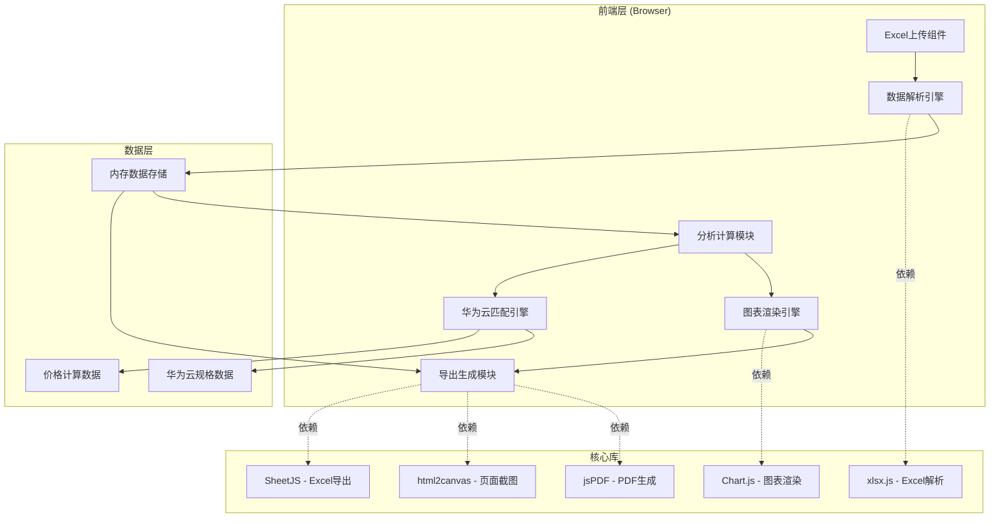
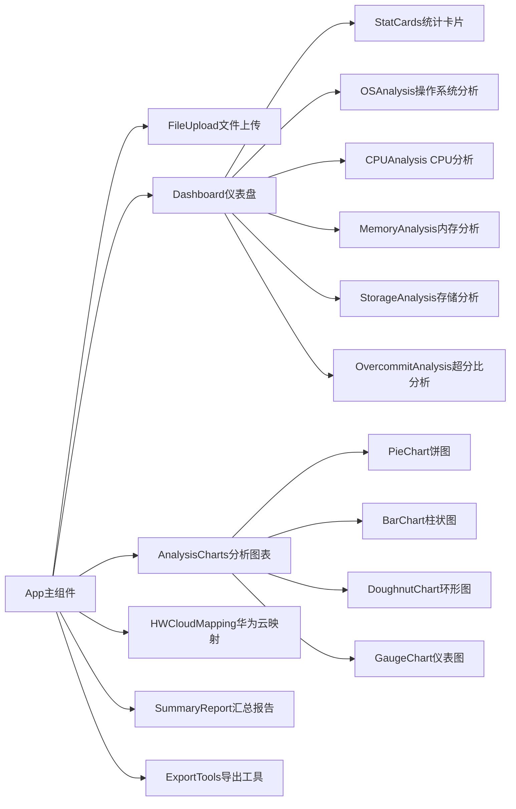
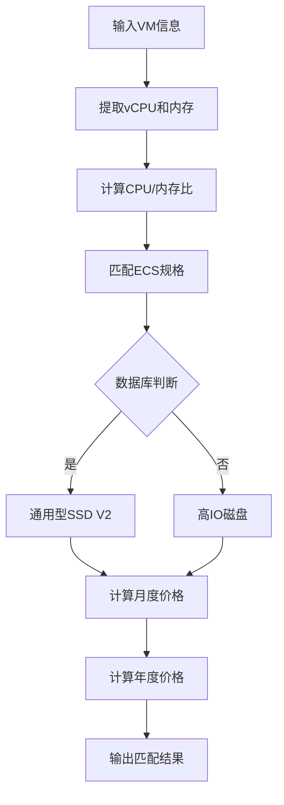
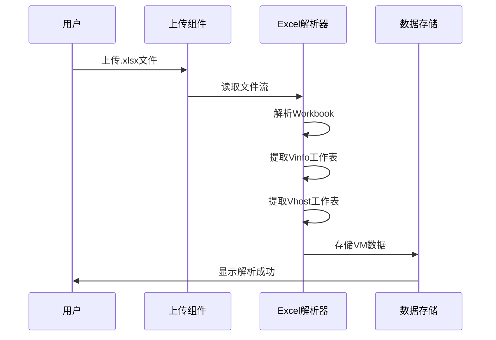
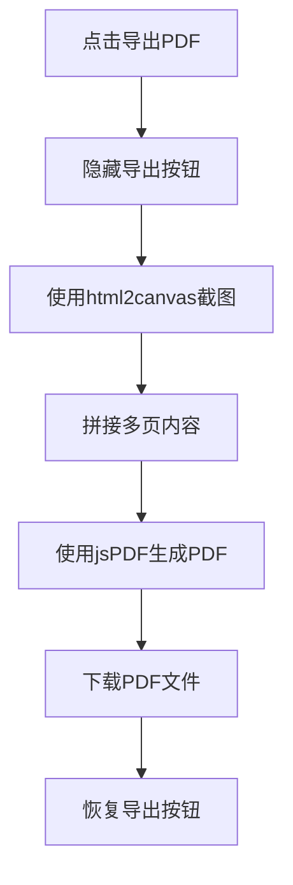

# RVTools Excel 分析工具 - 技术架构文档

## 1. 架构设计

### 1.1 系统架构图



### 1.2 技术栈选择

| 层级 | 技术选型 | 版本 | 说明 |
|------|----------|------|------|
| 框架 | React | 18.2+ | 组件化开发，状态管理 |
| 构建工具 | Vite | 5.0+ | 快速构建，热更新 |
| 样式框架 | Tailwind CSS | 3.4+ | 原子化CSS，高效开发 |
| Excel解析 | xlsx.js | 0.18+ | 支持xlsx/xls格式 |
| 图表库 | Chart.js | 4.4+ | 轻量级，支持多种图表 |
| PDF生成 | jsPDF + html2canvas | 2.5+ / 1.5+ | 客户端PDF生成 |
| Excel导出 | SheetJS | 0.18+ | 专业的Excel操作库 |
| 打包工具 | - | - | Vite内置 |

## 2. 模块设计

### 2.1 核心模块划分



### 2.2 华为云匹配引擎



## 3. 数据模型

### 3.1 核心数据结构

```typescript
// VM基础信息
interface VMInfo {
  name: string;
  os: string;
  cpu: number;
  memory: number; // MB
  cpuUsage: number; // %
  activeMemory: number; // MB
  provisionedStorage: number; // MiB
  inUseStorage: number; // MiB
  cpuReadiness: number; // %
  networkAdapters: number;
}

// vHost信息
interface VHostInfo {
  name: string;
  cores: number;
  cpu: number;
  memory: number;
}

// 华为云规格
interface HWCloudFlavor {
  name: string;
  family: string;
  vcpu: number;
  memory: number; // GiB
  maxDisks: number;
  maxNics: number;
  baremetal: boolean;
}

// 华为云映射结果
interface HWCloudMapping {
  vmInfo: VMInfo;
  isDatabase: boolean;
  category: string;
  flavor: HWCloudFlavor;
  diskSize: number;
  diskType: string;
  monthlyPrice: number;
  yearlyPrice: number;
}

// 分析结果
interface AnalysisResult {
  totalVMs: number;
  totalvCPUs: number;
  totalMemory: number; // GB
  totalStorage: number; // TB
  osDistribution: Record<string, number>;
  cpuUtilization: {
    normal: number; // <5%
    light: number; // 5-10%
    moderate: number; // >10%
    severe: number; // >20%
  };
  memoryUtilization: {
    waste: number; // <30%
    normal: number; // 30-60%
    tight: number; // >80%
  };
  storageUtilization: {
    waste: number; // <30%
    normal: number; // 30-70%
    full: number; // >80%
  };
  overcommitRatio: number;
  riskVMs: VMInfo[];
  hwCloudMappings: HWCloudMapping[];
}
```

### 3.2 数据流转

```mermaid
flowchart LR
    A[Excel File] -->|xlsx.js| B[Workbook Object]
    B -->|解析| C[VInfo Sheet]
    B -->|解析| D[VHost Sheet]
    C -->|映射| E[VMInfo[]]
    D -->|映射| F[VHostInfo[]]
    E -->|计算| G[Analysis Engine]
    F -->|计算| G
    G -->|输出| H[AnalysisResult]
    H --> I[Chart Data]
    H --> J[Mapping Data]
    I -->|渲染| K[Charts]
    J -->|匹配| L[HWCloud Engine]
    L -->|输出| M[Mapping Results]
```

## 4. 功能实现

### 4.1 Excel解析流程



**解析逻辑：**
1. 使用xlsx.read()读取文件
2. 遍历sheetNames找到"Vinfo"和"vHost"
3. 使用sheet_to_json()转换为JSON
4. 映射列名到VMInfo接口
5. 数据清洗（去除空行、处理缺失值）

### 4.2 分析计算模块

**CPU超分比计算：**
```javascript
const overcommitRatio = totalVMsCPU / totalHostCores;
```

**利用率计算：**
```javascript
const memUtil = (activeMemory / memory) * 100;
const storageUtil = (inUseStorage / provisionedStorage) * 100;
```

**风险判断：**
```javascript
if (cpuReadiness > 20) riskLevel = '严重';
else if (cpuReadiness > 10) riskLevel = '明显';
else if (cpuReadiness > 5) riskLevel = '轻微';
else riskLevel = '正常';
```

### 4.3 华为云规格匹配算法

```javascript
function matchFlavor(vm: VMInfo, flavors: HWCloudFlavor[]): HWCloudFlavor {
  const vmRatio = (vm.memory / 1024) / vm.cpu;
  
  // 过滤满足条件的规格
  const candidates = flavors.filter(f => 
    f.vcpu >= vm.cpu && 
    f.maxNics >= vm.networkAdapters
  );
  
  // 按CPU/内存比差异排序
  candidates.sort((a, b) => {
    const ratioA = Math.abs(a.memory / a.vcpu - vmRatio);
    const ratioB = Math.abs(b.memory / b.vcpu - vmRatio);
    return ratioA - ratioB;
  });
  
  // 返回最优匹配
  return candidates[0];
}
```

### 4.4 华为云价格计算

**ECS价格计算：**
```javascript
const ecsMonthlyPrice = basePricePerVCPU * vCPU + basePricePerGiB * memoryGiB;
const ecsYearlyPrice = ecsMonthlyPrice * 12 * yearlyDiscount;
```

**EVS价格计算：**
```javascript
const evsMonthlyPrice = diskSize * pricePerGiB;
const evsYearlyPrice = evsMonthlyPrice * 12 * yearlyDiscount;
```

**RI预留实例折扣：** 1年期约85折，3年期约65折

## 5. 组件设计

### 5.1 主要组件结构

```
src/
├── components/
│   ├── FileUpload/
│   │   ├── index.tsx
│   │   └── styles.css
│   ├── Dashboard/
│   │   ├── StatCard.tsx
│   │   └── index.tsx
│   ├── Charts/
│   │   ├── PieChart.tsx
│   │   ├── BarChart.tsx
│   │   ├── DoughnutChart.tsx
│   │   └── index.tsx
│   ├── Analysis/
│   │   ├── OSAnalysis.tsx
│   │   ├── CPUAnalysis.tsx
│   │   ├── MemoryAnalysis.tsx
│   │   ├── StorageAnalysis.tsx
│   │   └── OvercommitAnalysis.tsx
│   ├── HWCloudMapping/
│   │   ├── MappingTable.tsx
│   │   └── index.tsx
│   ├── SummaryReport/
│   │   └── index.tsx
│   └── Export/
│       ├── PDFExport.tsx
│       └── ExcelExport.tsx
├── hooks/
│   ├── useExcelParser.ts
│   ├── useAnalysis.ts
│   └── useHWCloudMapping.ts
├── utils/
│   ├── excelParser.ts
│   ├── analysisEngine.ts
│   ├── hwCloudMatcher.ts
│   ├── priceCalculator.ts
│   └── exporters.ts
├── data/
│   ├── hwCloudFlavors.ts
│   └── priceData.ts
├── types/
│   └── index.ts
├── App.tsx
├── main.tsx
└── index.css
```

### 5.2 核心组件说明

| 组件 | 职责 | 关键属性 |
|------|------|----------|
| FileUpload | 文件拖拽上传 | onFileChange, accept |
| StatCard | 统计卡片展示 | title, value, icon, trend |
| PieChart | 操作系统分布饼图 | data, colors |
| DoughnutChart | 利用率环形图 | data, thresholds |
| MappingTable | 华为云映射表格 | mappings, sortable |
| PDFExport | PDF报告生成 | contentRef, filename |

## 6. 华为云规格数据

### 6.1 ECS规格清单（部分）

| 实例类型 | vCPU | 内存(GiB) | 最大网卡 | 基准价格(元/月) |
|----------|------|-----------|----------|----------------|
| X6 | 1-64 | 2-256 | 8-16 | 35-2800 |
| C6 | 1-64 | 2-256 | 8-16 | 30-2400 |
| M6 | 1-64 | 2-256 | 8-16 | 32-2600 |
| S6 | 1-32 | 1-128 | 8 | 20-1600 |

### 6.2 EVS磁盘类型

| 磁盘类型 | 价格(元/GB/月) | 适用场景 |
|----------|----------------|----------|
| 高IO | 0.8 | 普通业务 |
| 通用型SSD V2 | 1.2 | 数据库、高性能需求 |
| 超高IO | 1.5 | 核心数据库 |

## 7. 性能优化

### 7.1 前端性能策略

- **懒加载：** 按需加载分析模块
- **虚拟列表：** 华为云映射表格使用虚拟滚动
- **防抖节流：** 文件拖拽和搜索输入
- **Web Worker：** 大文件Excel解析（可选）

### 7.2 内存管理

- 及时释放解析后的Workbook对象
- 图表实例销毁时清理
- 大数组处理使用分片

### 7.3 性能指标

| 指标 | 目标值 |
|------|--------|
| 首屏加载 | < 2秒 |
| Excel解析(1000VM) | < 3秒 |
| 图表渲染 | < 1秒 |
| PDF生成 | < 10秒 |

## 8. 导出功能设计

### 8.1 PDF导出流程



### 8.2 Excel导出结构

```
导出Excel:
├── Sheet1: 华为云映射明细
│   ├── 列: VM Name, OS, vCPU, Memory...
│   └── 数据: 所有VM的映射结果
├── Sheet2: 汇总统计
│   ├── 源端资源汇总
│   └── 华为云资源汇总
└── Sheet3: 分析数据
    ├── OS分布
    ├── CPU利用率分布
    ├── 内存利用率分布
    └── 存储利用率分布
```

## 9. 技术约束与风险

### 9.1 浏览器限制
- 不支持IE
- 需要现代浏览器（ES6+）

### 9.2 文件限制
- 最大文件：50MB
- 推荐VM数量：< 5000

### 9.3 已知风险
- 华为云价格需手动更新（实际价格以官网为准）
- 非标准RVTools格式可能导致解析失败
- 华为云规格需手动维护（实际规格以官网为准）

## 10. 部署方案

### 10.1 纯前端部署
- 构建产物：dist/
- 部署位置：静态文件服务器/CDN
- 无需后端服务

### 10.2 构建命令
```bash
npm install
npm run build
```

### 10.3 环境要求
- Node.js 18+
- npm 9+
