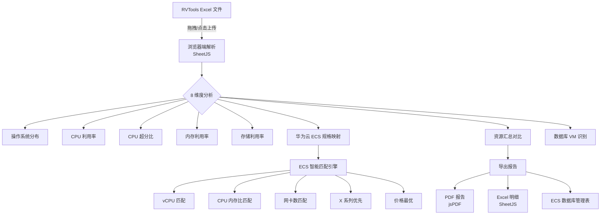

# RVTools VMware 迁移分析工具

[](LICENSE) [](https://www.huaweicloud.com/) []()

## 简介

RVTools VMware 迁移分析工具是一款**纯浏览器端**的 VMware 资源分析与华为云迁移规划工具。它解析 RVTools 导出的 Excel 文件，自动完成 8 维度资源分析、华为云 ECS/EVS 智能规格映射与价格估算，帮助迁移工程师快速输出迁移方案与成本报告。适用于 VMware 迁移评估、华为云资源规划、TCO 对比等场景。

## 目录

- [架构图](#架构图)
- [方案亮点](#方案亮点)
- [涉及云服务与费用](#涉及云服务与费用)
- [前置条件](#前置条件)
- [快速开始](#快速开始)
- [分步部署](#分步部署)
- [使用方法与验证](#使用方法与验证)
- [清理资源](#清理资源)
- [详细说明](#详细说明)
- [依赖与致谢](#依赖与致谢)
- [FAQ与故障排除](#faq与故障排除)
- [贡献指南](#贡献指南)
- [许可证](#许可证)
- [联系方式与维护者](#联系方式与维护者)

## 架构图



> 所有数据处理均在浏览器端完成，**不上传任何数据到服务器**，保障数据安全。

## 方案亮点

- **零部署** — 纯前端单页应用，打开浏览器即可使用，无需安装任何服务端组件
- **数据不出域** — 所有解析、分析、映射均在浏览器本地完成，敏感数据不离开用户设备
- **智能规格映射** — 5 条匹配规则自动推荐最优华为云 ECS 规格（vCPU ≥ 源端、CPU 内存比匹配、网卡数匹配、X 系列优先、价格最优）
- **8 维度分析** — 操作系统分布、CPU/内存/存储利用率、超分比、数据库 VM 识别、规格映射、资源汇总对比
- **多 Region 定价** — 支持 31 个华为云 Region + CNY/USD 双币种，含 Region 价格因子自动调整
- **一键报告** — 支持 PDF 报告、Excel 明细、ECS 数据库管理表三种导出格式
- **年度折扣** — 内置 1 年期 85 折、3 年期 65 折预留实例（RI）价格计算

## 涉及云服务与费用

| 华为云服务 | 用途 | 说明 |
|-----------|------|------|
| ECS（弹性云服务器） | VM 规格映射目标 | 工具仅做规格推荐与价格估算，不产生实际费用 |
| EVS（云硬盘） | 存储类型推荐 | 高 IO / 通用型 SSD V2 / ultra 三种类型 |

> ⚠️ **费用提醒**：本工具展示的价格为参考估算，实际价格以[华为云官网](https://www.huaweicloud.com/pricing.html)为准。本工具本身**不产生任何云资源费用**。

## 前置条件

| 项目 | 要求 |
|------|------|
| 浏览器 | Chrome 90+、Firefox 88+、Edge 90+、Safari 14+ |
| 网络 | 首次加载需访问 CDN（jsdelivr.net）获取依赖库 |
| 数据文件 | RVTools 导出的 `.xlsx` 或 `.xls` 文件 |
| 权限 | 无需华为云账号，无需任何云服务权限 |

## 快速开始

1. 下载本项目
2. 用浏览器打开 `index.html`
3. 选择 Region 和货币类型
4. 上传 RVTools Excel 文件，即可查看分析结果

```bash
# 克隆项目
git clone <repository-url>
cd migration-RVToolsVMware-main

# 直接打开（Windows）
start index.html

# 或使用 VS Code Live Server
# 右键 index.html -> Open with Live Server
```

## 分步部署

### 方式一：本地直接打开

```bash
# 步骤 1：进入项目目录
cd migration-RVToolsVMware-main

# 步骤 2：用浏览器打开
start index.html        # Windows
# open index.html       # macOS
# xdg-open index.html   # Linux
```

### 方式二：静态文件服务器部署

```bash
# 使用 Python 简易服务器
python -m http.server 8080

# 或使用 Node.js serve
npx serve .

# 浏览器访问 http://localhost:8080
```

### 方式三：部署到华为云 OBS 静态网站托管

1. 登录[华为云 OBS 控制台](https://console.huaweicloud.com/obs/)
2. 创建桶，开启静态网站托管
3. 上传 `index.html` 及相关文件
4. 通过桶域名访问

## 使用方法与验证

### 基本使用流程

1. **选择 Region** — 从下拉菜单选择目标华为云 Region（如 `cn-north-4`）
2. **选择货币** — 选择 CNY 或 USD
3. **上传文件** — 拖拽或点击上传 RVTools 导出的 Excel 文件
4. **查看结果** — 自动展示以下分析内容：
   - 统计卡片（VM 总数、vCPU 总数、内存总量、存储总量）
   - 操作系统分布（类型汇总 + 饼图/柱状图 + 版本详细分布）
   - CPU / 内存 / 存储利用率分析
   - CPU 超分比分析
   - 华为云 ECS 规格映射表
   - 资源汇总对比（VMware 源端 vs 华为云映射）
5. **导出报告** — 点击导出按钮生成 PDF / Excel 报告

### 验证部署成功

- 页面顶部显示华为云品牌蓝色渐变头部
- Region 下拉菜单包含 31 个区域选项
- 文件上传区域显示拖拽提示
- 上传示例 Excel 文件后，统计卡片显示正确的 VM 数量

## 清理资源

本工具为纯前端应用，**不创建任何云资源**，无需清理。

如需移除本地部署：

```bash
# 删除项目目录即可
rm -rf migration-RVToolsVMware-main
```

如已部署到华为云 OBS 静态网站托管，请在 OBS 控制台删除对应桶及文件。

## 详细说明

### ECS 规格匹配算法

匹配引擎按以下优先级依次筛选：

| 优先级 | 规则 | 说明 |
|--------|------|------|
| 1 | vCPU ≥ 源端 | 确保计算能力不低于源端 |
| 2 | CPU 内存比匹配 | 选择与源端 CPU/内存比最接近的规格 |
| 3 | 网卡数匹配 | 最大网卡数 ≥ 源端网卡数量 |
| 4 | X 系列优先 | 数据库等高性能场景优先选择 X 系列实例 |
| 5 | 价格最优 | 在满足以上条件的前提下选择最低价格 |

### 支持的 ECS 实例族

| 实例族 | 类型 | 适用场景 |
|--------|------|----------|
| x1e / x2e | 内存优化型 | 大型数据库、内存密集型应用 |
| c9 / c7 / c6 | 通用计算型 | Web 应用、中小型数据库 |
| s7 / s6 | 内存优化型 | 内存密集型应用 |
| m7 / m6 | 通用型 | 通用工作负载 |
| e3 / e3n | 通用型 | 中小型应用 |
| g6 | GPU 计算型 | GPU 加速应用 |

### 数据库 VM 识别规则

自动识别可能的数据库 VM：

- OS 名称包含数据库关键词：SQL、Oracle、MySQL、PostgreSQL、MongoDB、DB2、Redis 等
- CPU ≥ 4 且 Memory ≥ 8GB 的 Windows Server

### EVS 存储选择规则

| VM 类型 | 存储类型 | 说明 |
|---------|----------|------|
| 数据库 VM | 通用型 SSD V2 | 高 IOPS，适合数据库场景 |
| 其他 VM | 高 IO | 性能与成本均衡 |

### 价格计算

- **基准 Region**：华北-北京四（cn-north-4）
- **Region 价格因子**：不同 Region 乘以对应系数（如香港 1.3x、贵阳 0.9x）
- **年度折扣**：1 年期 85 折（RI）、3 年期 65 折（RI）
- **EVS 价格**：高 IO ¥0.35/GB/月、通用型 SSD V2 ¥0.48/GB/月、ultra ¥0.55/GB/月

### 配置项

所有配置通过界面交互完成，无需修改代码：

| 配置项 | 选项 | 默认值 |
|--------|------|--------|
| Region | 31 个华为云 Region | cn-north-4 |
| 货币 | CNY / USD | CNY |

### 辅助工具

| 文件 | 用途 |
|------|------|
| `diagnostic.html` | 环境检测与故障诊断（检测库加载、文件上传、Excel 解析） |
| `simple-version.html` | 简化版分析工具（仅基本统计和 VM 列表） |
| `test-upload.html` | 文件上传功能独立测试 |

## 依赖与致谢

### 主要依赖（CDN 加载）

| 库 | 版本 | 用途 |
|---|---|---|
| [SheetJS](https://sheetjs.com/) | 0.18.5 | Excel 文件解析与导出 |
| [Chart.js](https://www.chartjs.org/) | 4.4.0 | 图表渲染（饼图、柱状图） |
| [jsPDF](https://github.com/parallax/jsPDF) | 2.5.1 | PDF 报告生成 |
| [jsPDF-AutoTable](https://github.com/simonbengtsson/jsPDF-AutoTable) | 3.5.31 | PDF 表格生成 |

### 致谢

- [RVTools](https://www.robware.net/RVTools/) — VMware 环境信息导出工具
- [华为云](https://www.huaweicloud.com/) — ECS/EVS 规格与价格数据参考

## FAQ与故障排除

### 常见问题

**Q：选择文件后没有任何变化？**

1. 打开 `diagnostic.html` 检测环境
2. 按 F12 打开浏览器控制台查看错误
3. 确保使用 Chrome/Edge/Firefox 浏览器

**Q：文件验证失败？**

- 确保文件扩展名为 `.xlsx` 或 `.xls`
- 尝试用 Excel 重新保存文件

**Q：上传后一直显示"正在解析"？**

- 检查网络连接（CDN 库需首次加载）
- 文件过大时解析较慢，请耐心等待
- 尝试使用 `simple-version.html` 简化版

**Q：价格与华为云官网不一致？**

- 本工具价格为参考估算，实际价格以[华为云官网](https://www.huaweicloud.com/pricing.html)为准
- 价格数据可能存在更新延迟

> 更多故障排除请参阅 [README_TROUBLESHOOTING.md](README_TROUBLESHOOTING.md)

## 贡献指南

欢迎贡献！请阅读 [CONTRIBUTING.md](CONTRIBUTING.md) 了解贡献流程。

## 许可证

本项目基于 [Apache License 2.0](LICENSE) 许可证开源。

## 联系方式与维护者

- **维护团队**：华为云码道（CodeArts）
- **问题反馈**：请通过 GitHub Issues 提交
- **华为云官网**：[https://www.huaweicloud.com/](https://www.huaweicloud.com/)
